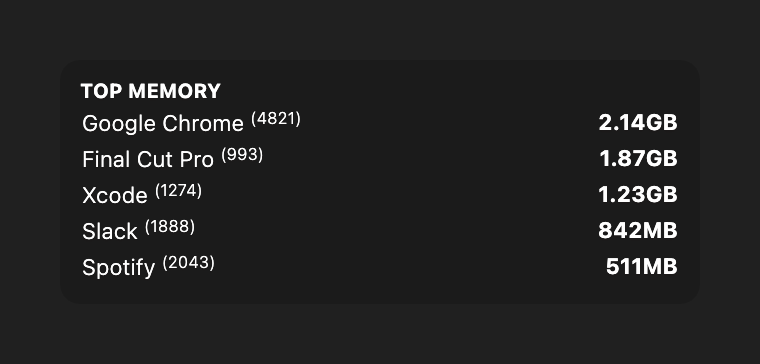

# Top Memory

A top memory widget for [Übersicht](http://tracesof.net/uebersicht/). It lists the five processes using the most memory, each with its name, PID, and memory usage. Colors are theme-aware, with sensible built-in defaults, so the widget works on its own.

## Screenshot

## Installation

- Download the [repository](https://github.com/dionmunk/uebersicht-top-memory/archive/master.zip) and extract it.
- Place the `top-memory.widget` folder in your Übersicht extension folder.
- Refresh Übersicht.

## License

This work is licensed under a [Creative Commons Attribution-NonCommercial 4.0 International License](https://creativecommons.org/licenses/by-nc/4.0/).
