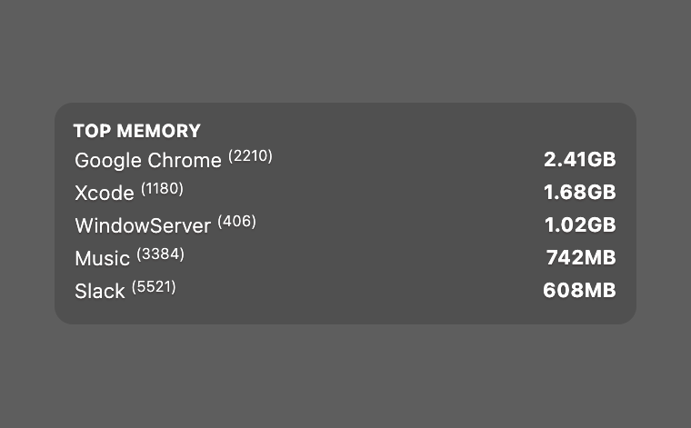

# Top Memory

A top memory widget for [Übersicht](http://tracesof.net/uebersicht/). It lists the five processes using the most memory, each with its name, PID, and memory usage. Colors are theme-aware, with sensible built-in defaults, so the widget works on its own.

## Screenshot

## Installation

- Download the [repository](https://github.com/dionmunk/uebersicht-top-memory/archive/master.zip) and extract it.
- Place the `top-memory.widget` folder in your Übersicht extension folder.
- Refresh Übersicht.

## Theming

This widget is theme-aware. Its colors come from CSS custom properties (text, panel tint, status and series colors) with sensible built-in fallbacks, so it looks right on its own. Install the [Theme Controller](https://github.com/dionmunk/uebersicht-theme-controller) widget and this one automatically follows its color scheme and light/dark mode, staying in sync with the rest of the collection.

## Layout

This widget is layout-aware. Its size comes from CSS custom properties published by the [Layout Controller](https://github.com/dionmunk/uebersicht-layout-controller) widget (column width, base row height, and gap), with its own fixed values as fallbacks, so it sizes correctly on its own. Install the Layout Controller and you can drag this widget anywhere on the desktop, snap it into a column, and have it stay where you put it across reloads and restarts.

## License

This work is licensed under a [Creative Commons Attribution-NonCommercial 4.0 International License](https://creativecommons.org/licenses/by-nc/4.0/).
